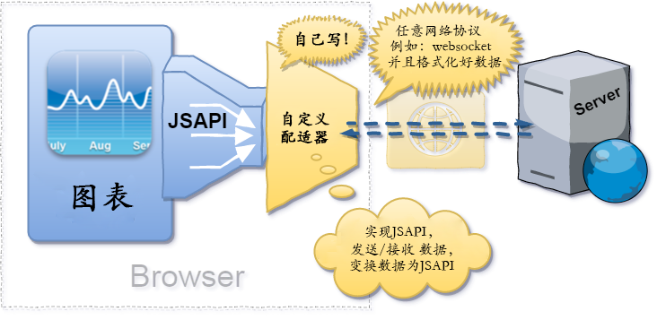

# 如何连接我的数据

---

**图表库并不包含市场数据**，你必须提供所需格式的数据。示例使用了Quandl历史数据。图表可以用两种方式接收数据：

1. 使用推模型技术实时更新，例如通过WebSocket。这样你的图表将会自动更新价格。为了达到这个目的，你必须使用[JavaScript API](JS-Api.md)并且准备好自己的传输方法。

2. 使用拉模型/脉冲\(pulse\)/刷新为基础进行更新（如当今大多数基于Web的图表），其中图表数据每X秒更新一次（图表客户端将要求服务器模拟推模型更新），或者被用户手动重新加载。 为此，请使用[UDF协议](/book/UDF.md)并编写自己的datafeed包装类。

### JavaScript API 或者 UDF?

## UDF scheme

## JSAPI scheme

上图显示了UDF和JSAPI之间的区别。 必须的图表库部分是蓝色的。 红色的部分（默认数据传输）包含在默认包中（具有未压缩的源代码），并可以被替换。 您可以看到默认数据传输实现JS API来与图表交互。此外，默认传输实现了与服务器通信的UDF协议。

1. **如果您已经准备好了数据传输**（websocket流传输，轮询或任何其他传输），
  或者如果您不需要流传输数据 - 请使用我们的[JavaScript API](JS-Api.md)，这是非常紧凑和易于实现。
  您必须使用JavaScript在数据传输和我们的图表之间创建一个小的 **客户端数据适配器**。

2. **如果您没有任何传输**，并且不需要流数据（例如，您只需要数据脉冲），
  那么您将不得不创建（或使用）至少一个服务器端的datafeed包装类。
  您可以使用任何语言和技术来实现这一目的：您的包装类只需要支持我们的数据交换协议（我们称之为[UDF](UDF.md)），以便能够为您的图表提供数据。
  您必须使用自己喜欢的语言在后端和我们的图表之间创建一个小的 **服务器端数据适配器**。

### 示例

**UDF-compatible** 实现示例。可以在[github](https://github.com/tradingview/yahoo_datafeed)上获得, 是一个服务器端包装类的示例, 它使用Quandl数据。

**JS API** 实现示例（和UDF客户端同时）为图表库的一部分（请参阅 `/datafeeds/udf/`文件夹）。